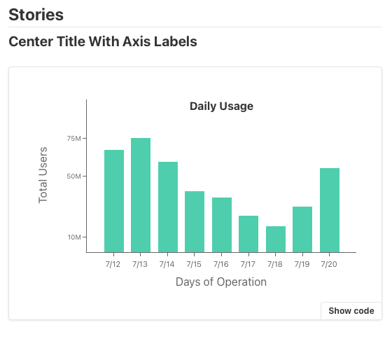
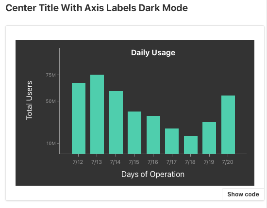

react-storybook-example
=======

This is a sample project to explore the latest version of [Storybook](https://storybook.js.org).

This project was bootstrapped with [Create React App](https://github.com/facebook/create-react-app).

# Graph Component

I made a simple implementation of the `Historgram` chart component shown in [Storybook Introduction page](https://storybook.js.org/docs/react/get-started/introduction) as an exercise.

**Sample**



**Dark Mode**




# Getting Started

Clone the repository, install the dependencies and run stroybook

```sh
$ git clone https://github.com/supershaneski/react-storybook-example.git myproject

$ cd myproject

$ npm install

$ npm run storybook
```

Your browser will open to `http://localhost:6006/` or some other port depending on the availability.

I made a sample page using the `graph` component. To run the app

```sh
$ npm start
```

This time your browser will open to `http://localhost:3000/` or some other port depending on the availability.

You can run both Storybook and app at the same time.


